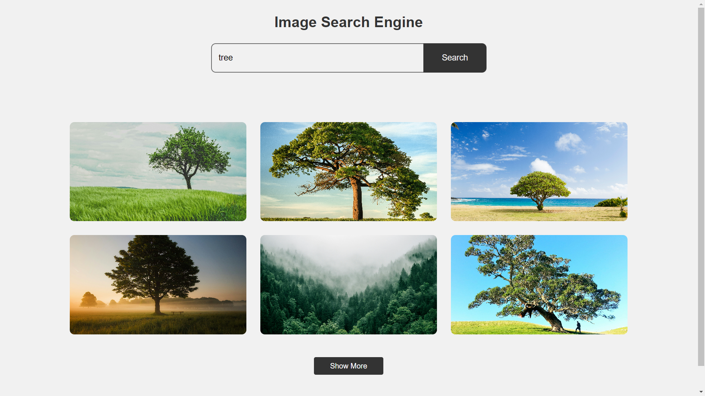

# Image Search Engine



A web application to search and display images using the Unsplash API. This project demonstrates the use of asynchronous JavaScript, DOM manipulation, and progressive image loading for an enhanced user experience.

## Features

- Search for images by keyword
- Display images in a responsive grid
- Progressive image loading (low-resolution preview to high-resolution image)
- Lazy loading for optimized performance
- Pagination with "Show More" button to load additional images

## Getting Started

### Prerequisites

- A modern web browser
- Internet connection

### Installation

1. Clone the repository:

```bash
git clone https://github.com/vraj-chovatiya/image-search-engine.git
cd image-search-engine
